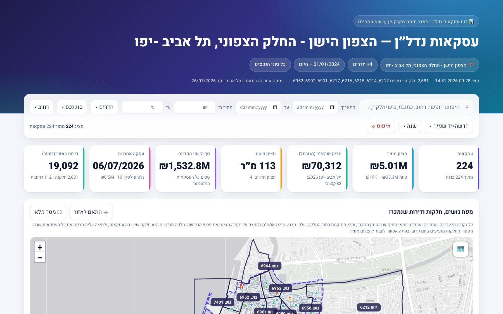
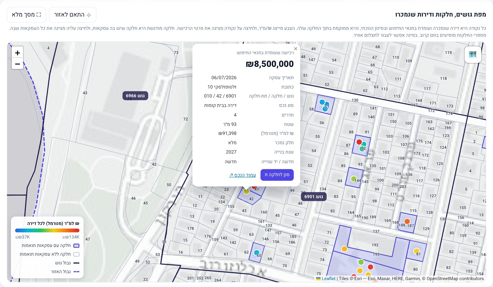
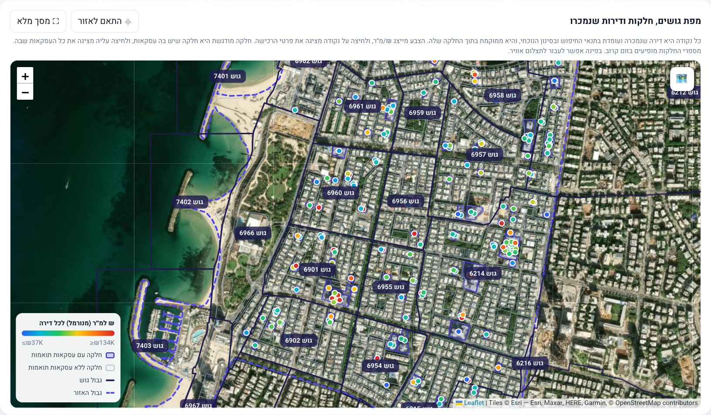
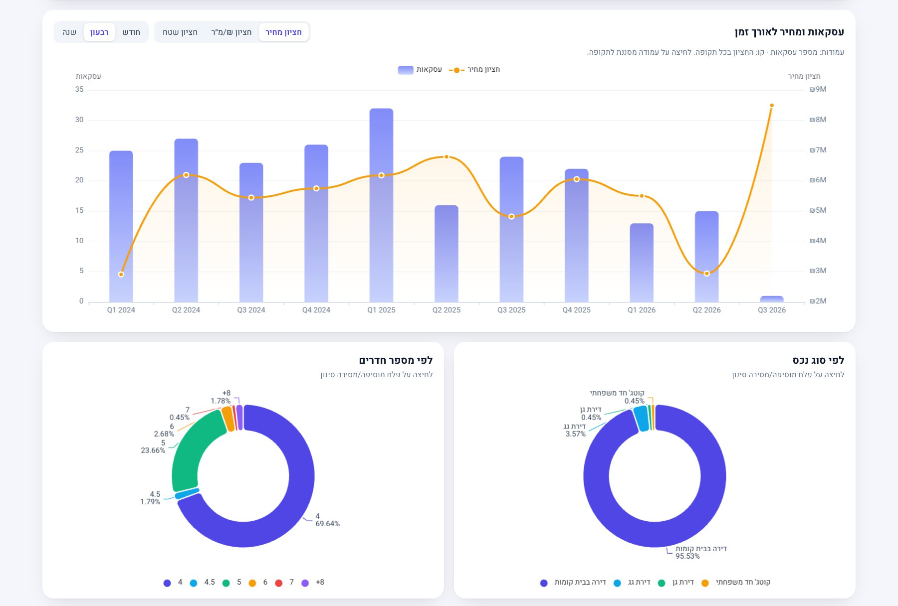
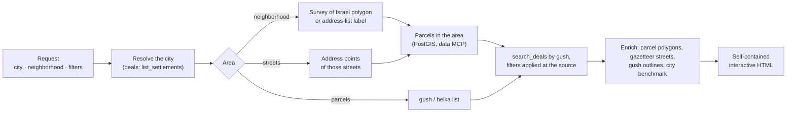

<div align="center">

# 🏡 nadlan

**Israeli real-estate transactions for AI agents and humans. Ask in plain language, get a live, interactive report.**

Query the Israel Tax Authority's register of **3.8 million reported real-estate deals (1998 → today)** through the [over.org.il](https://www.over.org.il/projects/deals) MCP servers, and turn any request like *"5+ room apartments above ₪3.5M in a neighborhood since 2024"* into a single self-contained HTML report with a gush/helka parcel map, cross-filtering charts and tables.




</div>

---

## Contents

- [What it does](#what-it-does)
- [Quick start](#quick-start)
- [Install the skill in your agent](#install-the-skill-in-your-agent) — Claude Code · Claude Desktop · Codex · omp · pi · Hermes · OpenClaw
- [Report examples](#report-examples)
- [Querying the data directly](#querying-the-data-directly)
- [The report](#the-report)
- [How it works](#how-it-works)
- [Privacy & security](#privacy--security)
- [Data caveats](#data-caveats)
- [Development](#development)
- [Credits & license](#credits--license)
- [בעברית](#בעברית)

## What it does

| | |
|---|---|
| 🗺️ **Parcel map** | Gush outlines, real parcel polygons, and **one dot per purchased apartment** that matches the search. Click a dot for the full purchase record; click a parcel for all of its deals. Light, street or satellite base maps. |
| 🔎 **Plain-language areas** | Neighborhoods (`נווה שאנן`, `הצפון הישן`…), streets, gush/helka lists or a whole city. Neighborhood names are resolved to parcels using the Survey of Israel neighborhood polygons (175 cities) and the national address list (88 cities). |
| 📊 **Cross-filtering dashboard** | Time series, donuts by property type / rooms / new vs. second-hand, street bars, area-vs-price scatter, price histogram and an area-vs-city benchmark. Clicking any slice filters everything, including the map. |
| 🧾 **Tables & export** | Breakdown by street, rooms, type, year, quarter, price or size bucket, or parcel; a sortable deals table with 📍 fly-to-map and CSV export. |
| 🤖 **Agent-ready** | Ships as a [`SKILL.md`](skills/over-nadlan-deals/SKILL.md) skill: the agent maps your request to parameters, resolves ambiguous names, builds the report and opens it. |
| 🪶 **Zero dependencies** | Python standard library only. The report is a single HTML file with its JS libraries inlined. |

## Quick start

**Requirements:** Python 3.9+ (standard library only; the `python3` that ships with macOS works), a browser, and a Google account (over.org.il's MCP servers use Google sign-in; the first login registers you automatically).

```bash
git clone https://github.com/aviv4339/nadlan.git
cd nadlan
S=skills/over-nadlan-deals/scripts

# 1. one-time login (opens Google sign-in in your browser)
python3 $S/over_mcp.py login

# 2. build your first report and open it
python3 $S/over_report.py build --city "תל אביב" --neighborhood "הצפון הישן - החלק הצפוני" \
    --min-rooms 4 --date-from 2024-01-01 --open
```

The report is written to `./nadlan-report-<area>-<date>.html`. A neighborhood usually takes about 30 seconds, and longer when the server is busy.

## Install the skill in your agent

The skill is the folder [`skills/over-nadlan-deals/`](skills/over-nadlan-deals/): a standard [Agent Skills](https://agentskills.io) `SKILL.md` plus its scripts. Every agent below uses the same folder and the same one-time login.

### 1. Get the skill and log in once

```bash
git clone https://github.com/aviv4339/nadlan.git ~/nadlan
SKILL=~/nadlan/skills/over-nadlan-deals

# one-time Google sign-in to over.org.il; the token is stored in ~/.config/over-mcp/state.json
# and shared by every agent on this machine
python3 "$SKILL/scripts/over_mcp.py" login
```

Symlinking (as below) keeps every agent on the latest version after a `git pull`. Use `cp -R` instead if you prefer a frozen copy.

### 2. Add it to your agent

| Agent | Install for all your projects | Or per project | Invoke |
|---|---|---|---|
| **Claude Code** | `mkdir -p ~/.claude/skills && ln -s "$SKILL" ~/.claude/skills/` | `.claude/skills/` | just ask, or `/over-nadlan-deals` |
| **Claude Desktop** | Code tab: same as Claude Code · Chat tab: [connectors](#claude-desktop) | | just ask |
| **Codex** | `mkdir -p ~/.agents/skills && ln -s "$SKILL" ~/.agents/skills/` | `.agents/skills/` | just ask, `$over-nadlan-deals`, or `/skills` |
| **omp** (oh-my-pi) | `mkdir -p ~/.omp/agent/skills && ln -s "$SKILL" ~/.omp/agent/skills/` | `.omp/skills/` | just ask, or `/skill:over-nadlan-deals` |
| **pi** | `mkdir -p ~/.pi/agent/skills && ln -s "$SKILL" ~/.pi/agent/skills/` | `.pi/skills/` | just ask, or `/skill:over-nadlan-deals` |
| **Hermes Agent** | `mkdir -p ~/.hermes/skills && cp -R "$SKILL" ~/.hermes/skills/` | | just ask, or `/over-nadlan-deals` |
| **OpenClaw** | `openclaw skills install "$SKILL" --global` | `openclaw skills install "$SKILL"` | just ask, or type `$` in the Control UI |

Start a new session afterwards, since most agents only scan for skills at startup. Then ask:

> *תן לי דוח על דירות של 5 חדרים ומעלה במחיר מעל 3,500,000 בשכונת רמת אביב ג׳, תל אביב, מ-2024 ועד היום*

> *Build a report of garden apartments sold in Jerusalem's German Colony since 2022*

> *Where did apartment prices rise the most between 2019 and 2025? Only cities with 100+ deals in each year.*

> *What sold on gush 6963 helka 14 in the last five years?*

The agent maps the request to parameters. If a name is ambiguous (Tel Aviv has five "הצפון" neighborhoods), it lists the candidates and asks, then builds and opens the report. It follows the source's own reporting rules: medians rather than means, filtering by deal type, and the number of deals next to every figure.

### Agent-specific notes

<details>
<summary><b>Claude Code</b></summary>

```bash
mkdir -p ~/.claude/skills && ln -s "$SKILL" ~/.claude/skills/over-nadlan-deals
```

- To share it with a team, commit the folder to your repo under `.claude/skills/over-nadlan-deals/`.
- Claude Code asks permission before running `python3`. Allow the `over_report.py` / `over_mcp.py` commands, or add them to your allowed commands.
- If the skill isn't picked up automatically, invoke it by name: `/over-nadlan-deals build a report for …`.

</details>

<details id="claude-desktop">
<summary><b>Claude Desktop</b></summary>

**Code tab (full skill, including reports).** The Code tab runs Claude Code on your machine and loads your personal skills from `~/.claude/skills/`, so install it exactly as for Claude Code above. Pick a **Local** environment. Cloud sessions don't read `~/.claude/skills/`, and SSH sessions read the remote host's copy. Reports open in the built-in Browser pane.

**Chat tab (questions and answers, no HTML reports).** Chat runs code in a cloud sandbox, where the Google login and the report builder can't run. Instead, connect the over.org.il MCP servers directly:

1. Open **Settings → Connectors → Add custom connector**.
2. Add each server you want, and click **Connect** to sign in with Google:
   - `https://www.over.org.il/deals/mcp`: the deals register
   - `https://www.over.org.il/nadlan/mcp`: address ↔ gush/helka lookups
   - `https://www.over.org.il/data/mcp`: SQL over everything
3. Ask about prices, trends and comparisons in the chat.

Optionally, upload the skill so Chat follows its data rules (medians, deal-type filtering, spelling pitfalls). Zip it with `cd ~/nadlan/skills && zip -r over-nadlan-deals.zip over-nadlan-deals`, upload it under **Customize → Skills → +**, and enable it. Code execution must be on in **Settings → Capabilities**.

</details>

<details>
<summary><b>Codex</b> (CLI, IDE extension, ChatGPT desktop app)</summary>

```bash
mkdir -p ~/.agents/skills && ln -s "$SKILL" ~/.agents/skills/over-nadlan-deals
```

- For a single repository, put it in `<repo>/.agents/skills/over-nadlan-deals/`. Codex follows symlinks. If the skill doesn't show up, restart Codex.
- Codex's default `workspace-write` sandbox blocks the network and any writes outside the workspace, but the skill needs `www.over.org.il` and `~/.config/over-mcp/`. Approve the escalation when Codex asks, or allow both in `~/.codex/config.toml`:

  ```toml
  [sandbox_workspace_write]
  network_access = true
  writable_roots = ["/Users/<you>/.config/over-mcp"]   # absolute path
  ```

</details>

<details>
<summary><b>omp</b> (oh-my-pi)</summary>

```bash
mkdir -p ~/.omp/agent/skills && ln -s "$SKILL" ~/.omp/agent/skills/over-nadlan-deals
```

- For a single project, use `<project>/.omp/skills/over-nadlan-deals/`.
- Force-load it with `/skill:over-nadlan-deals <request>`.

</details>

<details>
<summary><b>pi</b></summary>

```bash
mkdir -p ~/.pi/agent/skills && ln -s "$SKILL" ~/.pi/agent/skills/over-nadlan-deals
```

- For a single project, use `.pi/skills/over-nadlan-deals/`. Pi also reads the shared `~/.agents/skills/` location.
- Force-load it with `/skill:over-nadlan-deals <request>`, and run `/reload` after updating the skill mid-session.

</details>

<details>
<summary><b>Hermes Agent</b></summary>

```bash
mkdir -p ~/.hermes/skills && cp -R "$SKILL" ~/.hermes/skills/
hermes skills list | grep over-nadlan-deals     # verify
```

- Installed skills take effect in new sessions; use `/reset` to start one.
- Every skill is also a slash command: `/over-nadlan-deals build a report for …`.
- Hermes often runs on a server. See [logging in on a remote machine](#logging-in-on-a-remote-machine).

</details>

<details>
<summary><b>OpenClaw</b></summary>

```bash
openclaw skills install "$SKILL" --global     # shared across agents (~/.openclaw/skills)
openclaw skills install "$SKILL"              # or just the active agent's workspace skills/
openclaw skills check                         # verify it's ready
```

- `openclaw skills install git:…` expects `SKILL.md` at the repository root, but here it lives in `skills/over-nadlan-deals/`, so install from the cloned folder as shown.
- Reference the skill with `$` in the Control UI composer, or just ask.
- OpenClaw often runs on a server. See [logging in on a remote machine](#logging-in-on-a-remote-machine).

</details>

### Logging in on a remote machine

The login opens Google in a browser and waits for the redirect on `127.0.0.1:53682`. On a headless server you have two options:

```bash
# A. tunnel the callback: on your laptop
ssh -L 53682:127.0.0.1:53682 you@server
#    then, in that SSH session, run the login and open the printed URL in your laptop's browser
python3 ~/nadlan/skills/over-nadlan-deals/scripts/over_mcp.py login

# B. log in on your laptop, then copy the token file (it refreshes itself)
ssh you@server 'mkdir -p ~/.config/over-mcp && chmod 700 ~/.config/over-mcp'
scp ~/.config/over-mcp/state.json you@server:~/.config/over-mcp/state.json
ssh you@server 'chmod 600 ~/.config/over-mcp/state.json'
```

Treat `state.json` like a password: it grants access to your over.org.il account.

## Report examples

All examples use `S=skills/over-nadlan-deals/scripts`.

```bash
# Not sure what the neighborhood is called? List what's known for a city
python3 $S/over_report.py areas --city "תל אביב" --q "הצפון"
#   הצפון הישן - החלק הצפוני   polygon    m²=1817524   [תל אביב-יפו]
#   הצפון הישן - החלק הדרומי   polygon    m²=1348069   [תל אביב-יפו]
#   כוכב הצפון                  polygon    m²=421194    [תל אביב-יפו]
#   ...

# A neighborhood, 5+ rooms, ₪3.5M and up, 2024 → today
python3 $S/over_report.py build --city "ירושלים" --neighborhood "רחביה" \
    --min-rooms 5 --min-amount 3500000 --date-from 2024-01-01 --open

# Specific streets, apartments only, a price band
python3 $S/over_report.py build --city "תל אביב" --streets "דיזנגוף,בן יהודה" \
    --nature "דירה בבית קומות" --min-amount 2500000 --max-amount 6000000 --date-from 2025-01-01

# Exact parcels (gush:helka, or a whole gush)
python3 $S/over_report.py build --city "תל אביב" --parcels "6963:14,7091" --date-from 2020-01-01

# A whole city, penthouses and garden apartments, a fixed year
python3 $S/over_report.py build --city "חיפה" --nature "דירת גג" --nature "דירת גן" \
    --date-from 2025-01-01 --date-to 2025-12-31 --title "חיפה 2025 — גג וגן"

# Also dump the underlying data for your own analysis
python3 $S/over_report.py build --city "רמת גן" --neighborhood "מרום נווה" --json ramat-gan.report.json
```

| flag | meaning |
|---|---|
| `--city` | City or settlement, in Hebrew. Partial names work and resolve to the register's exact spelling (e.g. `תל אביב` → `תל אביב -יפו`). |
| `--neighborhood` / `--streets` / `--parcels` | The area; use one of them. Without any, the report covers the whole city (capped by `--max-deals`, default 5000). |
| `--min-rooms` `--max-rooms` | Inclusive room range. |
| `--min-amount` `--max-amount` | Inclusive reported price range, in ₪. |
| `--date-from` `--date-to` | `YYYY-MM-DD`. Leave out `--date-to` for "until today". |
| `--nature` | Deal type, repeatable, as exact strings: `דירה בבית קומות`, `דירת גן`, `דירת גג`, `קוטג' חד משפחתי`, … (47 in total). Default is every type, broken down in the report. |
| `--title` `--out` `--json` | Report title, output path, and an optional JSON payload dump. |
| `--no-benchmark` `--open` | Skip the city-wide comparison; open the report when done. |

Exit code `2` means the place is unknown or ambiguous, and the candidates are printed to stderr.

## Querying the data directly

[`over_mcp.py`](skills/over-nadlan-deals/scripts/over_mcp.py) is a tiny MCP client for all over.org.il servers. It is also importable (`call_tool`, `rpc`).

```bash
C="python3 skills/over-nadlan-deals/scripts/over_mcp.py"

$C tools deals                                           # list tools + input schemas
$C call deals list_settlements '{"query":"הרצ"}'         # exact register spelling: הרצלייה
$C call deals price_series '{"settlement":"חיפה","nature":"דירה בבית קומות","date_from":"2019-01-01"}'
$C call deals compare_settlements '{"year_from":2019,"year_to":2025,"nature":"דירה בבית קומות","min_deals":100,"limit":10}'
$C call deals parcel_deals '{"gush":6963,"helka":14,"limit":5}'
$C call nadlan lookup_property '{"city":"תל אביב","street":"דיזנגוף","number":"100","include_stat_area":false}'

# read-only SQL (PostGIS) over the whole database, e.g. deals per year in a city
$C call data run_sql '{"sql":"SELECT substr(deal_date,7,4) AS year, count(*) FROM public.append_taxes_nadlan_full_f41fb496_fd06f5ae WHERE settlement = $$חיפה$$ GROUP BY 1 ORDER BY 1 DESC LIMIT 5"}'
```

| server | what it's for |
|---|---|
| `deals` | The register: `search_deals`, `price_series`, `compare_settlements`, `list_settlements`, `list_deal_types`, `parcel_deals`, `register_stats` |
| `nadlan` | Property cross-reference: address ↔ gush/helka, statistical area, parcel geometry, street suggestions |
| `data` | Read-only SQL across every mirrored table: deals, parcel polygons, neighborhoods, asset gazetteer, national address list |

SQL table names carry version hashes that change when the source is re-snapshotted. See [`SKILL.md`](skills/over-nadlan-deals/SKILL.md#data-mcp-sql--for-custom-analysis) for the current tables and their pitfalls.

## The report

<table>
<tr>
<td width="50%"><br><sub><b>Parcel map.</b> Every dot is a purchased apartment; click it for the full record.</sub></td>
<td width="50%"><br><sub><b>Satellite view.</b> Gush outlines, highlighted parcels and the neighborhood border.</sub></td>
</tr>
<tr>
<td colspan="2"><br><sub><b>Cross-filtering charts.</b> Click any bar or slice to filter the whole report.</sub></td>
</tr>
</table>

- **Filter bar:** free-text search, date and price ranges, multi-selects (rooms, type, street, new vs. second-hand, year), active-filter chips and a reset button.
- **KPIs:** deal count, median price, median ₪/m² next to the city-wide median, median size, total reported value, latest deal, and dwellings in the area.
- **Time series** by month, quarter or year, showing the median price, ₪/m² or size. Clicking a bar filters to that period.
- **Methodology footer** with the source links and the exact queries behind every number (over.org.il `/data` console links).

## How it works



- **Area → parcels.** A parcel belongs to a neighborhood when its inner point (`ST_PointOnSurface`) falls inside the neighborhood polygon. Where there's no polygon, the parcels holding the addresses labelled with that neighborhood are used.
- **Deals.** They are fetched per gush with every filter applied server-side, then kept only for the area's parcels. The number fetched is checked against the source's reported total, and any gap is flagged in the report.
- **Streets.** Each deal is attributed from the gazetteer street of its exact sub-parcel, then the addresses linked to its parcel, then the nearest address inside the area (≤150 m, marked ≈).
- **Rendering.** [ECharts](https://echarts.apache.org/) and [Leaflet](https://leafletjs.com/) are downloaded once to `~/.config/over-mcp/vendor/` and inlined into every report, so a report is a single portable file.

## Privacy & security

- **No secrets in the repo.** OAuth tokens live only in `~/.config/over-mcp/state.json` (file mode `0600`), outside the project. `.gitignore` also blocks `state.json` and `.env`.
- **Your login is between you and over.org.il.** The client uses OAuth 2.1 with PKCE and dynamic client registration; no client secret exists or is needed. The sign-in itself happens with Google in your own browser.
- **What leaves your machine:** MCP requests to `www.over.org.il`. Viewing a report loads map tiles from Esri (`server.arcgisonline.com`) and the Heebo font from Google Fonts. Nothing else, and no telemetry.
- **Reports contain public data only:** register rows, plus the parameters you chose, shown in the header.

## Data caveats

- **Reported, not verified.** Amounts are what was reported to the Tax Authority, not appraised market prices. Rows are published as-is.
- **Medians, not means.** One row can be a single apartment or an entire building, so all statistics are medians.
- **Normalized ₪/m²** = amount ÷ (area × sold portion). The area is the whole property, while the price covers only the portion sold.
- **Apartment dots are schematic.** The register has no in-building location, so a parcel's deals are fanned out inside it.
- **Neighborhood borders are indicative.** Deals are linked to parcels by gush + helka only.
- **Freshness.** Reports trail today by 1–2 weeks overall, and a single city can lag by about 2 months.
- **New vs. second-hand** is inferred by comparing the building year with the deal year, not from who the seller was.

## Development

```bash
cd skills/over-nadlan-deals/scripts
python3 -m unittest -v test_over_report    # offline, no network or login needed
```

```
skills/over-nadlan-deals/
├── SKILL.md                  # agent instructions: workflow, tools, data rules, SQL tables
└── scripts/
    ├── over_mcp.py           # MCP client + OAuth (PKCE) login
    ├── over_report.py        # area resolution, fetching, enrichment, rendering
    ├── report_template.html  # the report UI (RTL, ECharts + Leaflet)
    └── test_over_report.py   # offline tests
```

Issues and pull requests are welcome.

## Credits & license

- **Data:** [גרסאות לעם / over.org.il](https://www.over.org.il/), which mirrors and versions Israeli government open data. The deals come from the Israel Tax Authority real-estate register (מיסוי מקרקעין). Neighborhood polygons come from the Survey of Israel (govmap), and the asset gazetteer and national address list from data.gov.il.
- **Libraries:** [Apache ECharts](https://echarts.apache.org/) (Apache-2.0) and [Leaflet](https://leafletjs.com/) (BSD-2-Clause), downloaded at build time and not vendored in this repo. Base maps © Esri and contributors.
- **License:** code under the [MIT License](LICENSE).
- **Disclaimer:** this project is not affiliated with over.org.il, the Israel Tax Authority or the Survey of Israel. It is informational, not financial or legal advice.

## בעברית

**nadlan** הופך בקשה בשפה חופשית, כמו *"דירות 5 חדרים ומעלה מעל 3.5 מיליון בשכונה X מ-2024"*, לדוח HTML אינטראקטיבי שמבוסס על מאגר עסקאות המקרקעין של רשות המסים (3.8 מיליון עסקאות מ-1998) דרך שרתי ה-MCP של [גרסאות לעם](https://www.over.org.il/projects/deals).

- **מפה:** גושים וחלקות, ונקודה לכל דירה שנמכרה. לחיצה על נקודה מציגה את פרטי הרכישה.
- **גרפים וטבלאות:** מסננים זה את זה, כולל ייצוא ל-CSV.
- **זיהוי שכונות:** לפי שכבת השכונות של המרכז למיפוי ישראל ולפי רשימת הכתובות הארצית.
- **סטטיסטיקה:** חציונים בלבד, ו-₪/מ״ר מנורמל לפי החלק שנמכר.

התקנה ושימוש מפורטים ב[התחלה מהירה](#quick-start). הערכים הם השווי המדווח לרשות המסים, לא מחיר שוק מאומת.
